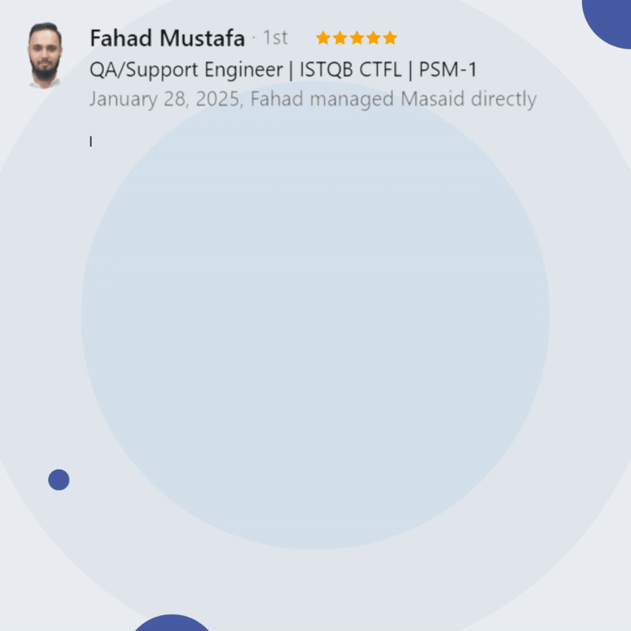

# 🌟 Welcome to My Portfolio Repository! 🌟  
---
### 👋 Hi, I'm **MASAID ZEB**  
🚀 ISTQB® Certified Software Quality Assurance Engineer  

---
---

## 📌 Table of Contents

### 🚀 Overview  
- [🎯 About This Repository](#-about-this-repository)  
- [✨ Features of This Portfolio](#-features-of-this-portfolio)  
- [🎯 Purpose](#-purpose)  
- [👨‍💻 About Me](#-about-me)
    
### 🎯🏆📈🔍 **# Testing Achievements & Milestones: My Projects**  
- [1️⃣ Selenium-Based Automation for Engineer Registration - Pakistan Engineering Council (PEC)](#1️⃣-selenium-based-automation-for-engineer-registration---pakistan-engineering-council-pec)
- [2️⃣ Quality Assurance for EPE Portal | Pakistan Engineering Council (PEC)](#2️⃣-quality-assurance-for-epe-portal-pakistan-engineering-council-pec)
 - [3️⃣ Extensive QA for CPD Portal | Pakistan Engineering Council (PEC)](#3️⃣-extensive-qa-for-cpd-portal-pakistan-engineering-council-pec)
 - [4️⃣ Selenium-Based Automation - Engineer Renewal Application | ERD Portal (PEC)](#4️⃣-selenium-based-automation---engineer-renewal-application--erd-portal-pec)
- [5️⃣ Evolo AI (Student Mobile App, Institute Mobile App, Employer Web App)](#5️⃣-evolo-ai-student-mobile-app-institute-mobile-app-employer-web-app)
- [6️⃣ Omni-Channel Web App (BPO Service Integration)](#6️⃣-omni-channel-web-app-bpo-service-integration)

### 🚀 Other Projects  
- [📱 ATHADhak](#-athadhak)
- [📚 DA Library (Mobile App)](#-da-library-mobile-app)
- [🌐 PIEDC Portal](#-piedc-portal)

### 🛠️📖🔍 Personal Learning Projects  
 - [Cypress Automation](#cypress-automation)

### 🔬 Quality Assurance & Testing  
- [🎯 Testing Types & Methodologies](#-testing-types--methodologies)  
- [🩺 Quality Assurance & Defect Management](#-quality-assurance--defect-management)  
- [🚀 Development Processes](#-development-processes)  
- [🧪 Testing Techniques](#-testing-techniques)  
- [⚙️ Tools & Frameworks](#️-tools--frameworks)  

### 📊 Certifications  
- [🏆 Key Certifications](#-key-certifications)  
- [🎓 Skill-Based Certifications](#-skill-based-certifications)  
- [📚 Additional Knowledge](#-additional-knowledge)  
### 💬  Recommendation     
### 🤝 Connect & Collaborate  
- [🤝 Let's Connect!](#-lets-connect)  
- [🎯 Ready to Collaborate? Download My CV!](#-ready-to-collaborate-download-my-cv)  

---

### 🎯 **About This Repository**  
This repository hosts my **personal portfolio**, a professional showcase of my journey as a **Software Quality Assurance (SQA) Engineer**. Here, you'll find insights into my skills, projects, and expertise in:  

- 🛠️ **Manual & Automation Testing**: Expertise in Cypress (JavaScript) and Selenium (Python) for creating automation frameworks.  
- 📊 **Performance Testing**: Skilled in tools like JMeter and BlazeMeter for ensuring system reliability.  
- 🔗 **API Testing**: Proficient in Postman for end-to-end API validation.  
- ✅ **Quality Assurance Practices**: Experienced in functional, non-functional, and exploratory testing.  

---

### ✨ **Features of This Portfolio**  
- 📝 Detailed overview of my experience and ISTQB® CTFL certification.  
- 📂 Showcase of my projects, skills, and technical expertise.  
- 🎨 Clean, responsive design for the best user experience.  

---

### 🎯 **Purpose**  
This portfolio serves as a dynamic, scalable, and professional representation of my skills in **software quality assurance** and **testing**. It’s my way of sharing my journey, achievements, and expertise with the world.  

💬 **Feedback** is always welcome! Feel free to explore and reach out.  

---

### 🚀 **Explore More**  
🌐 Visit my portfolio site for a full experience!  

---

⭐️ If you like this repository, consider giving it a **star**!  

---
---

## 👨‍💻 About Me  
- 🎓 **Education**: BSc Electrical Engineering from [University of Engineering & Technology, Lahore](https://www.uet.edu.pk/about-uet/introduction/vision-mission/)  
- 🧪 **Experience**: 1.5 years in QA, specializing in manual/automation testing, performance optimization, and defect management  
- 🏆 **Certifications**:  
  - [ISTQB® Certified Tester Foundation Level (CTFL) v4.0](http://scr.istqb.org/?name=Masaid+Zeb&number=24-CTFL4-1433-PK&orderBy=relevancy&orderDirection=&dateStart=&dateEnd=&expiryStart=&expiryEnd=&certificationBody=&examProvider=&certificationLevel=&country=&resultsPerPage=10)  
  - Scrum Fundamentals Certified (SFC™)

🎨 A Creative Reflection of My Name

💡 "Meticulously Analyzing Software, Assuring Impeccable Deliverables, Zealously Eliminating Bugs" ✨

> Each letter of my name **Masaid Zeb** represents my approach to QA:
> - **M**: Meticulously 🔍
> - **A**: Analyzing 🧠
> - **S**: Software 💻
> - **A**: Assuring ✅
> - **I**: Impeccable 🌟
> - **D**: Deliverables 📦

> - **Z**: Zealously 🔥
> - **E**: Eliminating 🚫
> - **B**: Bugs 🐞

This phrase embodies my commitment to excellence in Software Quality Assurance, using my name as a testament to my skills and dedication. 🚀

---

# 📌 Projects

## 1️⃣ [Selenium-Based Automation for Engineer Registration - Pakistan Engineering Council (PEC)](https://www.linkedin.com/in/masaid-sqa/details/projects/)
🗓 **Duration**: Sep 2024 - Oct 2024  

🚀 **Objective**:  
Automated testing of the PEC’s engineer registration portal to streamline and speed up registration processing for engineers in Pakistan.

💡 **Key Features**:  
✨ End-to-end automation for seamless registration  
✨ Reduction in manual testing efforts  
✨ Faster regression testing cycles  
✨ Enhanced operational efficiency

🔧 **Technologies Used**:  
Python 🐍, Selenium 🕹, Automation Testing

🏆 **Achievements**:  
This project demonstrated real-world automation skills that greatly improved operational efficiency. Looking forward to applying more advanced techniques to future projects!

🔑 **Skills**:  
Automation Testing · Selenium WebDriver · Regression Testing · Test Automation Frameworks · Continuous Integration · Bug Tracking · Quality Assurance

🔗 **Link to Project**: [Project Link](https://github.com/masaid2244/Engineer_registration_PEC_new_Application)  

---

## 2️⃣ [Quality Assurance for EPE Portal](https://cpd.pec.org.pk/EPECustom) | [Pakistan Engineering Council](https://www.pec.org.pk/)
🗓 **Duration**: Jan 2024 - Jul 2024 

🎯 **Objective**:  
Conducted extensive QA for the Engineering Practice Examination (EPE) Portal, which plays a vital role in the CPD framework for Registered Engineers to become Professional Engineers.

🎯 **Key Responsibilities**:  
- Requirement Analysis: Ensured accurate EPE registration and CPD points tracking.  
- Manual Testing: Verified CPD point accumulation and eligibility processes.  
- Automation Testing: Developed Selenium scripts for EPE registration and exam validation.  
- Performance Testing: Ensured portal scalability under high traffic.  
- Boundary Value Analysis (BVA) & Use Case Testing: Full test coverage for edge cases.

🏆 **Achievements**:  
Key contributor to the first-ever online computer-based EPE exam held in Rawalpindi and Islamabad in May 2024.

🔧 **Technologies & Tools**:  
Selenium 🕹, JMeter 🚀, MySQL 💾, Postman 📬, Git 🐙, Agile (UAT Testing)

🔑 **Skills**:  
Manual Testing · Performance Testing · Exploratory Testing · Regression Testing · Automation Frameworks · Bug Reporting

🔗 **Link to Project**: [Project Link](https://cpd.pec.org.pk/EPECustom)  

---

## 3️⃣ [Extensive QA for CPD Portal](https://cpd.pec.org.pk/) | [Pakistan Engineering Council (PEC)](https://www.pec.org.pk/)
🗓 **Duration**: Jan 2024 - Apr 2024  

🚀 **Objective**:  
QA testing for PEC’s key portal to ensure engineers meet CPD eligibility criteria for registration renewals.

🎯 **Focus**:  
- Verifying the accurate accumulation of CPD points.  
- Streamlining workflows for formal education, work-based learning, and developmental activities.

🎯 **Key Responsibilities**:  
- Requirement Analysis: Detailed analysis of CPD criteria.  
- Manual Testing: Verified CPD point tracking and calculation accuracy.  
- Automation Testing: Selenium-based automation for CPD workflows.  
- Performance Testing: Evaluated system response and scalability.

🔧 **Technologies & Tools**:  
Manual & Automation Testing (Selenium with Python) 🐍, JMeter 🚀, MySQL 💾, Git 🐙, Postman 📬

🔑 **Skills**:  
Functional Testing · Boundary Value Analysis (BVA) · Equivalence Partitioning (EP) · Regression Testing · Performance Testing · User Acceptance Testing (UAT)

🔗 **Link to Project**: [Project Link](https://cpd.pec.org.pk/)  

---

## 4️⃣ [Selenium-Based Automation - Engineer Renewal Application | ERD Portal (PEC)](https://github.com/masaid2244/Engineer-Renewal-Application-Automation---PEC---ERD-portal)

🔧 **Project Summary**:  
Automated the renewal process for engineers through PEC’s ERD Portal using Python and Selenium. The automation reduced manual interventions and enhanced the overall renewal process.

🎯 **Key Skills Used**:  
Automated Software Testing 🤖, Agile Test Methodology 📅, Performance Testing 🚀
· Selenium WebDriver · Regression Testing · Test Automation Frameworks

🔗 **Link to Project**: [Project Link](https://github.com/masaid2244/Engineer-Renewal-Application-Automation---PEC---ERD-portal)  

## 5️⃣ [Evolo AI](https://play.google.com/store/apps/details?id=com.hiddenworkers.evoloaiapp&pcampaignid=web_share) (Student Mobile App, Institute Mobile App, Employer Web App) 
🔗 **Associated with**: [AI Mark Lab](https://www.linkedin.com/company/ai-mark-labs/posts/?feedView=all)

🚀 **Project Overview**:  
Evolo AI is a platform designed to connect students with employers. The mobile app (available for both Android and iOS) allows students to create profiles, find employers, and apply for jobs in a simple and intuitive way. The web app serves as a bridge between employers and job seekers, providing features like job listings, employer questions, and AI-driven chatbots for assistance. AI is used to optimize job matching and help students apply with minimal effort.

🎯 **Key Responsibilities**:
- **Mobile Testing**:  
  - Tested Android and iOS builds. 
  - Performed black-box testing and session-based testing.  
  - Used mobile testing techniques and tools (e.g., API testing with Postman).
- **QA for AI Models**:  
  - Verified how AI agents and chatbots were trained and their responses.  
  - Ensured AI models provided relevant job information and supported the application process.
- **Agile/Scrum**:  
  - Used Jira for project tracking and bug reporting.  
  - Participated in Agile Scrum methodology with regular sprints and stand-ups.
- **UI/UX Interaction**:  
  - Collaborated with the design team using Figma to review UI elements.  
  - Wrote test cases based on the FDS (Functional Design Specification).

🔧 **Technologies & Tools Used**:  
React Native, MongoDB, Postman, JIRA, GitHub, TestFlight, Jmeter 

🔑 **Skills**:  
Mobile Testing · API Testing · Black-box Testing · Manual Testing · AI Model QA  · Agile Scrum

---

## 6️⃣ Omni-Channel Web App (BPO Service Integration)
🔗 **Associated with**: [Mexil Software solutions](https://www.linkedin.com/company/mexil-software-solutions/posts/?feedView=all)

🚀 **Project Overview**:  
The Omni-channel web app integrates multiple communication platforms (Facebook, WhatsApp, SMS, Instagram, Email, Call) to provide a seamless user experience. It operates with three distinct panels: Admin, Employer, and Company. The app functions similarly to a BPO service, allowing companies and employers to manage and communicate with their employees and clients through different communication channels.

🎯 **Key Responsibilities**:
- **Web App Testing**:  
  - Performed manual testing using black-box testing and session-based techniques.  
  - Ensured smooth integration of chat services and verified multi-channel communications (chat, email, SMS, Facebook, Whatsapp, Instagram, Call).
  - Focused on UI localization, ensuring the app was user-friendly across different regions.
- **API Testing**:  
  - Conducted API testing for data integration and process flow using Postman.
  - Validated the performance of APIs, ensuring responsiveness and stability under load.
- **Data Validation**:  
  - Validated data flow between the web app and the backend SQL database.  
  - Ensured that data presented to users was accurate and consistent.

🔧 **Technologies Used**:  
MERN Stack (MongoDB, Express, React, Node.js), Postman for API Testing, SQL for database, GitHub, Figma

🔑 **Skills**:  
Web App Testing · Manual Testing · API Testing · Data Validation · UI Testing · Agile Scrum · Kanban 

---
# 🚀 Other Projects  
While these projects are smaller in scale, they demonstrate my versatility and ability to tackle different challenges using various tools and technologies. Each project was an opportunity to refine my skills in QA&QC, problem-solving, and software testing. Below are a few of the noteworthy side projects I’ve worked on:

| #️⃣ | Project Name | Key Responsibilities | QA Skills Applied |
|----|-------------|----------------------|------------------|
| 1️⃣ | 📱 **ATHADhak** | - Performed **UI Testing**, **Front-end Testing**, **API Testing (Postman)**, and **Localization Testing**.    - Focused on ensuring a smooth **user experience**.   - Verified **responsiveness** and **cross-browser compatibility**.   - Ensured seamless integration between front-end and back-end services.  | 🔹 **Functional & Non-Functional Testing**   🔹 **Exploratory Testing**   🔹 **Usability Testing**   🔹 **Ad Hoc Testing** |
| 2️⃣ | 📚 **DA Library (Mobile App)** | - Conducted **manual QA testing** for this mobile application.    - Verified **functionality, usability, and performance**.   - Ensured **smooth navigation** and **error-free user interactions**. | 🔹 **System Testing**   🔹 **User Acceptance Testing (UAT)**   🔹 **Regression Testing**   🔹 **AI-Driven Testing** |
| 3️⃣ | 🌐 **PIEDC Portal** | - Conducted **detailed manual QA testing** for this enterprise portal.    - Validated **end-to-end workflows, forms, and data integrity**.   - Ensured **cross-platform compatibility**.   - Wrote and executed **test cases** for multiple scenarios.   - Collaborated with developers to resolve critical issues. | 🔹 **End-to-End Testing**   🔹 **Integration Testing**   🔹 **Defect Root Cause Analysis**   🔹 **Test Documentation** |

---

# 🛠️📖🔍 Personal Learning Projects

### Cypress Automation
 1️⃣🌟 Learn Automation with Cypress 🌟
- Gained hands-on experience in **Cypress** for end-to-end testing.  
- Wrote **automated test scripts** covering UI functionalities, alerts, tables, dropdowns, and file uploads.  
- Performed **UI validation, element interaction, and assertions** to ensure test accuracy.  
- Implemented **data-driven testing** for scalable test execution.  
- Followed a **structured, beginner-friendly approach** with well-commented test cases.  
- **Future Goals:**  
  - Develop **end-to-end automation projects** using **Page Object Model (POM)**.  
  - Automate **real-world demo projects** to enhance practical skills.  
- 🌟 **Discover my work** and dive into the details of my projects on GitHub! **[Explore Here](https://github.com/masaid2244/Cypress-Sample-Test-Cases)** 🚀

---

## 🛠️ Skills Overview  

### 🎯 **Testing Types & Methodologies**  

| **Area of Expertise**              | **Skills** |
|------------------------------------|----------------------------------------------------------------------------------------------------------------|
| ✅ **Core Testing Types**          | Manual Testing 📝, Automation Testing 🤖, Functional Testing ✅, Non-Functional Testing 🛠️, Regression Testing 🔄, System Testing 🖥️, End-to-End Testing 🌐 |
| 🔍 **User-Centric Testing**        | UI Testing 🎨, Usability Testing 🎛️, User Acceptance Testing (UAT) 🎭, A/B Testing ⚖️ |
| 🏗️ **Structural & Integration**    | Integration Testing 🔗, Alpha & Beta Testing 🏁, Smoke & Sanity Testing 🚀, Cross-Browser Testing 🌍 |
| 📊 **Data & AI-Enhanced**          | Data-Driven Testing 📊, AI-Driven Testing 🤖, Exploratory Testing 🕵️‍♂️, Ad Hoc Testing 🎯 |

---

### 🩺 **Quality Assurance & Defect Management**  

| **Key Focus**                     | **Skills** |
|-----------------------------------|--------------------------------------------------------------------------------------|
| 🔎 **Defect & Issue Handling**    | Defect Lifecycle Management 🚦, Bug Tracking 🐞, Defect Reporting 📢, Root Cause Analysis 🔍 |
| 📜 **Test Documentation**         | Test Data Management 📂, Test Documentation 📜, Requirements Traceability (RTM) 🧾 |

---

### 🔄 **Development Processes**  

| **Aspect**                        | **Skills** |
|-----------------------------------|--------------------------------------------------------------------------------------|
| 🌀 **Agile & SDLC/STLC**          | Agile (Scrum/Kanban) 🌀, SDLC & STLC 🔄, Shift-Left Testing ⏩, Risk-Based Testing ⚠️ |
| 🎯 **Test Strategy & Planning**   | Test Strategy Development 🎯, Test Planning 📝, Test Metrics 📊, Test Case Design ✍️, Acceptance Criteria 📑 |
| 🔢 **Test Data & Validation**     | Test Data Creation & Validation 🔢, Behavior-Driven Development (BDD) 🏗️ |

---

### 🧪 **Testing Techniques**  

| **Technique Type**                 | **Skills** |
|-----------------------------------|--------------------------------------------------------------------------------------|
| 🎭 **Functional & Black Box**      | Black Box Testing ⚫, Boundary Value Analysis 📏, Equivalence Partitioning 🔢, State Transition Testing 🔀 |
| 🌐 **API & Performance Testing**   | API Testing 🌐, Load Testing 📈, Stress Testing 💥, Performance Testing ⚡ |
| 🧠 **Advanced Testing**            | Codeless Test Automation 🦾, Static & Dynamic Testing 🔄, Decision Table Testing 📋, Error Guessing ❓, Use Case Testing 📂 |

---

### ⚙️ **Tools & Frameworks**  

| **Category**                        | **Tools** |
|-------------------------------------|--------------------------------------------------------------------------------------|
| 🧪 **Test Automation & Execution**  | Selenium (Pytest) 🧪, Cypress 🌿, JMeter 🌡️, Postman 📮 |
| 🛠️ **Development & Test Management** | Git 🗂️, JIRA 📝, Testworthy ✔️, Zephyr 📝, MySQL 🗃️, DBeaver 🏗️, AI-Powered Testing 🤖 |
| 🔍 **Debugging & Performance**      | Chrome DevTools 🌐, Bugzilla 🐛, BlazeMeter 🔥, Testim ⚡ |
| 🖥️ **IDE & Communication**         | PyCharm 💻, Visual Studio Code 🖥️, Slack 💬, Loom 🎥 |

---

### 🌟 **Soft Skills**  

| **Skill Set**                    | **Skills** |
|---------------------------------|------------------------------------------------------------|
| 🧠 **Analytical & Problem-Solving** | Critical Thinking 🧠, Problem Solving 🔍, Analytical Thinking 📊, Technical Aptitude 🏆 |
| 🤝 **Teamwork & Communication**   | Collaboration 🤝, Effective Communication 🗣️, Leadership & Mentorship 👨‍🏫, Teamwork 👥 |
| ⏳ **Productivity & Adaptability** | Proactive Approach 🚀, Attention to Detail 🔬, Time Management ⏳, Adaptability 🔄 |

---
---

## 📊 Certifications  

### 🏆 Key Certifications  
1. 🎯 **ISTQB® Certified Tester Foundation Level (CTFL)**  
   - [License No. 24-CTFL4-1433-PK](https://pstb.pk/testers/Certified%20Tester%20Foundation%20Level)  
2. 📜 **[Scrum Fundamentals Certified (SFC™)](https://www.linkedin.com/in/masaid-sqa/details/certifications/)**  
3. 🚀 **[Apache JMeter™ Pro](https://www.linkedin.com/in/masaid-sqa/details/certifications/)**  

---

### 🎓 Skill-Based Certifications  
4. 🔍 **[Fundamentals of Testing with TestRail](https://drive.google.com/file/d/1bdR8LadfSUylTMDmjX29R99RIe_tiRkm/view)**  
5. 🛠 **[Introduction to JIRA](https://www.simplilearn.com/skillup-certificate-landing?token=eyJjb3Vyc2VfaWQiOiI0MjYxIiwiY2VydGlmaWNhdGVfdXJsIjoiaHR0cHM6XC9cL2NlcnRpZmljYXRlcy5zaW1wbGljZG4ubmV0XC9zaGFyZVwvNzcwNTM0MF83OTYzMTIwMTczNTA0NzM3MzU2OS5wbmciLCJ1c2VybmFtZSI6Ik1hc2FpZCBaZWIgLSBJU1RRQlx1MDBhZShDVEZMKSJ9&utm_source=shared-certificate&utm_medium=lms&utm_campaign=shared-certificate-promotion&referrer=https%3A%2F%2Flms.simplilearn.com%2Fcourses%2F7229%2FIntroduction-to-JIRA%2Fcertificate%2Fdownload-skillup&%24web_only=true&_branch_match_id=1322944259118790284&_branch_referrer=H4sIAAAAAAAAA8soKSkottLXL87MLcjJ1EssKNDLyczL1k%2FVjzA2Mk72cXN2DEiyrytKTUstKsrMS49PKsovL04tsvUBqkpN8cwDAGUjk%2FNBAAAA)**  
6. ✅ **[Zephyr Scale User Guide](https://www.linkedin.com/in/masaid-sqa/details/certifications/)**  
7. 🖱 **[Web Element Locator Strategies](https://testautomationu.applitools.com/certificate/?id=5dbca55a)**  
8. 🐍 **[Introduction to pytest](https://testautomationu.applitools.com/certificate/?id=3873d504)**  
9. 🤖 **[Selenium WebDriver with Python](https://testautomationu.applitools.com/certificate/?id=53ed526c)**  
10. 🏗 **[Object Oriented Programming Foundations](https://www.linkedin.com/in/masaid-sqa/details/certifications/)**  
11. 🔑 **[Setting a Foundation for Successful Test Automation](https://testautomationu.applitools.com/certificate/?id=67d10cae)**  
12. 🌐 **[Introduction to API Testing with Postman](https://www.linkedin.com/in/masaid-sqa/details/certifications/)**  
13. 💾 **[Introduction to Database and SQL](https://www.mygreatlearning.com/certificate/TAPXCWPK)**  

---

### 📚 Additional Knowledge  
14. 🧑‍💻 **[Software Testing Tutorial](https://www.mygreatlearning.com/certificate/YSSCNZYH)**  
15. ✍️ **[Writing Effective User Stories](https://10pearlsuniversity.org/view-certificate/?cid=10PUC-419f5b1020ebb86ece351c48cde17af4b2ca96c96ef0df55237798390)**  
16. 🔬 **[API Testing and Basic Overview of JMeter](https://10pearlsuniversity.org/view-certificate/?cid=10PUC-6268a545daf6231bc4246f7d324bb0b1184b4434333e6956237794618)**  
17. ⚙️ **[QA Fundamentals](https://10pearlsuniversity.org/view-certificate/?cid=10PUC-69bf026d2af9c2937126ac81e728c04f23c6050cb9d28501237798728)**  
18. 📝 **[Test Case Management with Testworthy](https://10pearlsuniversity.org/view-certificate/?cid=10PUC-c47eca8b2eff06e4984cb102e4d64a394172a325a1754820237797962)**  
19. 🎓 **[SQA Bootcamp](https://www.linkedin.com/in/masaid-sqa/details/certifications/)**  
20. 🔍 **[Google Chrome Developer Tool](https://cursa.app/en/my-certificate/cert36a4b14dbfa8a01663f7f0d4e2388934)**
21. 📚 **[Accessibility fundamentals](https://learn.microsoft.com/en-gb/users/masaidzeb-2359/achievements?tab=tab-modules)**  

---

## 💬  Recommendation  
> **Fahad Mustafa , Manager @ Pakistan Engineering Council**

> **"I had the privilege of managing Masaid Zeb, and it was truly rewarding to see him grow as a Software Quality Assurance Engineer. He brought a perfect blend of enthusiasm, curiosity, and a strong work ethic, which made a significant impact on our projects.
Masaid quickly familiarized himself with our tools and processes and demonstrated exceptional attention to detail. His remarkable R&D skills stood out, as he consistently mastered new tools and technologies independently. He often provided updates on his progress within the same day, showcasing his efficiency and dedication.
What I appreciated most about Masaid was his willingness to learn and improve. He was always open to feedback and used it as an opportunity to refine his skills. It’s rare to see someone with such a proactive and positive approach to personal and professional growth.
Within just a couple of months, Masaid was entrusted with the Engineer Practice Exam (EPE) Portal for the Pakistan Engineering Council. This project marked the first-ever computer-based EPE in Pakistan’s history. Masaid’s dedication was unparalleled—he worked tirelessly, even during holidays, to ensure the project’s success. He consistently completed tasks ahead of schedule, setting a standard of reliability and commitment.
I have no doubt that Masaid will continue to excel in his career. With his skills, determination, and drive, he is destined to achieve great things, and I look forward to seeing all that he accomplishes in the future."**  

---

## 🤝 Let's Connect!  
- 📧 **Email**: [masaid.zeb2244@gmail.com](mailto:masaid.zeb2244@gmail.com)  
- 🔗 **LinkedIn**: [Masaid Zeb ISTQB® (CTFL)](https://www.linkedin.com/in/masaid-sqa/)  
- 💻 **GitHub**: [Masaid Zeb's GitHub](https://github.com/masaidezeb2244)
- 🌟 **Upwork**: [Masaid Zeb Upwork Account](https://www.upwork.com/freelancers/~0142d8a3e4667f52e8)   
- 📍 **Location**: Islamabad, PK
  
---
---

  # 🎯 Ready to Collaborate? Download My CV!

🌟 **Discover my expertise and experience in detail!**  
🚀 **My CV highlights:**

- Proven skills in Software Quality Assurance  
- Hands-on expertise in Manual & Automation Testing, API Testing, and Performance Optimization  
- Certifications like ISTQB® CTFL and Scrum Fundamentals Certified (SFC™)  

📥 **[[Click here to download my CV]](https://drive.google.com/file/d/1fze8Fjn0mUFDe1AurqGHOO1gfpQMR6QM/view?usp=sharing)** and explore how I can contribute to your team or project!  

💡 **Let’s build quality together!**

---
---
💡 "Meticulously Analyzing Software, Assuring Impeccable Deliverables, Zealously Eliminating Bugs!"
